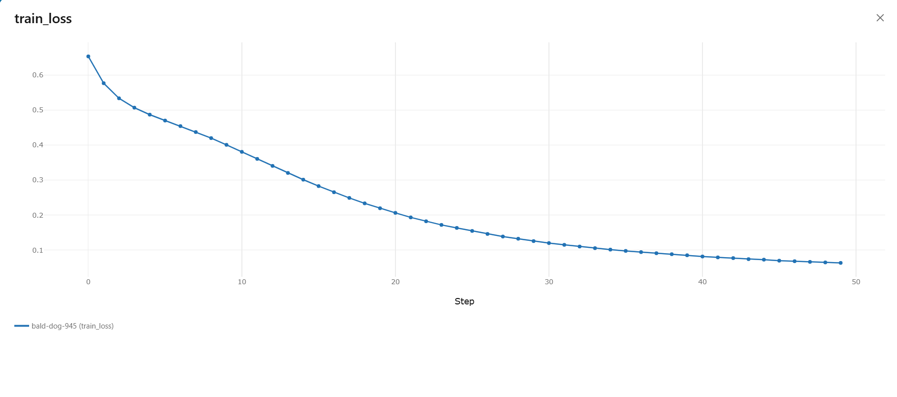
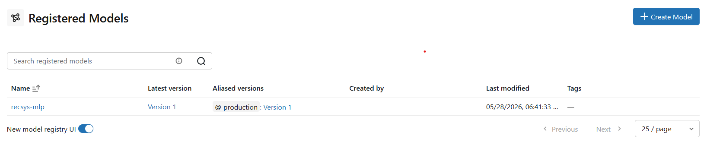
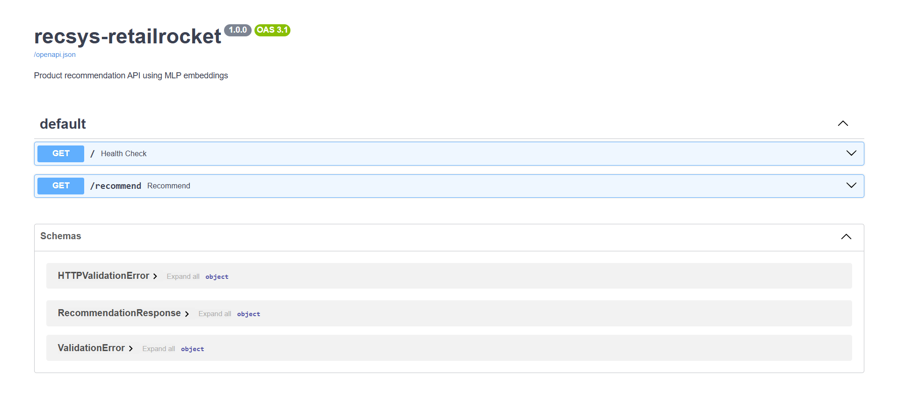

# Fase 2 — Sistema de Recomendação de Produtos (E-commerce)

> **Status:** 🔧 Pipeline funcional (Docker + DVC + MLflow) · Documentação e testes em finalização
> **Disciplinas:** 01 (Clean Code) · 02 (Dependências) · 03 (Docker) · 04 (DVC + MLflow + PyTorch)

Sistema de recomendação de produtos baseado no comportamento de navegação de
usuários de e-commerce. O modelo central é uma **rede neural MLP** (PyTorch)
treinada sobre uma matriz de interações usuário-item, com todo o pipeline
containerizado em Docker, dados e pipeline versionados com **DVC**, e
experimentos rastreados no **MLflow**.

Dataset: [RetailRocket](https://www.kaggle.com/datasets/retailrocket/ecommerce-dataset)
(eventos de navegação `view` / `addtocart` / `transaction`).

---

## Índice

- [Como rodar](#como-rodar)
  - [Opção 1 — Docker (recomendado)](#opção-1--docker-recomendado)
  - [Opção 2 — Ambiente local com Poetry](#opção-2--ambiente-local-com-poetry)
- [Pipeline de dados (DVC)](#pipeline-de-dados-dvc)
- [Experimentos e Model Registry (MLflow)](#experimentos-e-model-registry-mlflow)
- [Arquitetura do modelo](#arquitetura-do-modelo)
- [Design patterns e clean code](#design-patterns-e-clean-code)
- [Testes e linting](#testes-e-linting)
- [Variáveis de ambiente](#variáveis-de-ambiente)
- [Limitações conhecidas / débito técnico](#limitações-conhecidas--débito-técnico)

## Como rodar

### Opção 1 — Docker (recomendado)

Pré-requisitos: Docker e Docker Compose instalados, e o dataset já puxado via
DVC (`dvc pull`, se você tiver acesso ao remote configurado) ou colocado
manualmente em `data/raw/events.csv`.

```bash
cp .env.example .env   # ajuste os valores se necessário

docker compose up --build mlflow   # sobe o servidor MLflow (http://localhost:5000)
docker compose run --rm --remove-orphans train dvc repro
```

Isso builda a imagem, sobe o MLflow server, e roda o pipeline completo
(`preprocess → feature_eng → train → evaluate`) dentro do container `train`.
Acompanhe os experimentos em **http://localhost:5000**.

Para registrar o melhor modelo no Model Registry após o treino:

```bash
docker compose run --rm --remove-orphans train python -m scripts.register_model
```

### Opção 2 — Ambiente local com Poetry

```bash
poetry install
poetry run python scripts/validate_env.py   # confere se o ambiente está OK
cp .env.example .env

# sobe o MLflow localmente (em outro terminal)
poetry run mlflow server --host 0.0.0.0 --port 5000

# roda o pipeline
poetry run dvc repro
```

---

## Pipeline de dados (DVC)

O `dvc.yaml` define 4 stages encadeadas:

| Stage | Comando | Entrada | Saída |
|---|---|---|---|
| `preprocess` | `python -m src.data.preprocess` | `data/raw/events.csv` | `data/processed/events_processed.csv` |
| `feature_eng` | `python -m src.features.feature_engineer` | eventos processados | matriz esparsa usuário-item + features de usuário |
| `train` | `python -m src.models.train` | matriz + features | `models/recommender.pt` + `metrics/train_metrics.json` |
| `evaluate` | `python -m src.evaluation.evaluator` | modelo treinado | `metrics/eval_metrics.json` |

Reproduzir o pipeline inteiro (local ou dentro do container):

```bash
dvc repro
```

Ver o grafo de dependências:

```bash
dvc dag
```

---

## Experimentos e Model Registry (MLflow)

- Cada execução de `train.py` cria um run no experimento configurado em
  `MLFLOW_EXPERIMENT_NAME`, logando hiperparâmetros, métricas (`best_loss`,
  épocas treinadas) e o modelo (`mlflow.pytorch.log_model`, formato `pickle`).
- `early stopping` é aplicado durante o treino para evitar overfitting.
- `scripts/register_model.py` busca o run com menor `best_loss`, registra o
  modelo no Model Registry e promove automaticamente o alias **`staging`**.
  A promoção para **`production`** só acontece se a variável
  `PROMOTE_TO_PRODUCTION=true` estiver definida — por padrão o modelo fica
  retido em staging até validação manual.

```bash
poetry run python -m scripts.register_model
# ou, para promover direto a produção:
PROMOTE_TO_PRODUCTION=true poetry run python -m scripts.register_model
```

- `scripts/compare_models.py` compara o modelo MLP treinado contra o baseline
  de popularidade (`src/models/baseline.py`) usando as mesmas métricas do
  evaluator (`precision@k`, `recall@k`, `ndcg@k`, `hit_rate@k`).

---

## Arquitetura do modelo

- **`MLPRecommender`** (`src/models/train.py`): rede neural feed-forward
  (PyTorch) treinada sobre a matriz esparsa usuário-item construída na etapa
  de feature engineering.
- **Baseline**: recomendador por popularidade (`src/models/baseline.py`),
  usado como referência mínima de comparação.
- **Pesos de interação**: eventos são ponderados por relevância —
  `view = 1`, `addtocart = 3`, `transaction = 5` — antes de montar a matriz
  esparsa de interações.
- **Reprodutibilidade**: seeds fixadas (`random`, `numpy`, `torch`) via
  `set_seeds()` no início do treino.

---

## Design patterns e clean code

- **Factory Pattern** (`src/models/factory.py`): `ModelFactory` permite
  registrar e instanciar diferentes modelos de recomendação (`baseline`,
  `mlp`, ...) por nome, sem acoplar o restante do pipeline a uma classe
  concreta — implementado via `BaseRecommender` (`src/models/base.py`) como
  interface comum.
- **Type hints e docstrings** em todas as funções públicas.
- **Pydantic Settings** (`src/configs/settings.py`) centraliza toda a
  configuração do projeto, lida a partir do `.env`.
- **Lint:** [`ruff`](https://docs.astral.sh/ruff/) configurado em
  `pyproject.toml` (`E`, `F`, `I`, `N`, `UP`, `B`).

---

## Testes e linting

```bash
poetry run pytest tests/ -q
poetry run ruff check .
```

---

## Variáveis de ambiente

Configuradas via `.env` (veja `.env.example`), lidas por
`src/configs/settings.py`:

| Variável | Default | Descrição |
|---|---|---|
| `MLFLOW_TRACKING_URI` | `http://localhost:5000` | Endpoint do servidor MLflow |
| `MLFLOW_EXPERIMENT_NAME` | `recsys-retailrocket` | Nome do experimento no MLflow |
| `DATA_RAW_PATH` | `data/raw` | Diretório do dataset bruto |
| `DATA_PROCESSED_PATH` | `data/processed` | Diretório das saídas intermediárias |
| `MODELS_PATH` | `models` | Diretório de saída do modelo treinado |
| `RANDOM_SEED` | `42` | Seed fixada para reprodutibilidade |
| `BATCH_SIZE` | `256` | Tamanho do batch de treino |
| `LEARNING_RATE` | `0.001` | Taxa de aprendizado |
| `NUM_EPOCHS` | `50` | Épocas máximas de treino |
| `PROMOTE_TO_PRODUCTION` | `false` | Se `true`, `register_model.py` promove o modelo direto para produção após staging |

> ⚠️ Use sempre `/` como separador de caminho nas variáveis acima, mesmo no
> Windows — o valor é usado dentro de containers Linux.

---

## Resultados

| Metric | Baseline | MLP |
|---|---|---|
| Precision\@10 | 0.0046 | 0.0014 |
| Recall\@10 | 0.0053 | 0.0044 |
| NDCG\@10 | 0.0063 | 0.0028 |
| Hit Rate\@10 | 0.0254 | 0.0138 |

--

## Screenshots

### Training Loss (MLflow)


### Model Registry


### Live API (Swagger UI)


--

## Live Demo

- **Swagger UI:** https://recsys-retailrocket.onrender.com/docs
- **Health check:** https://recsys-retailrocket.onrender.com
- **Recommendations:** https://recsys-retailrocket.onrender.com/recommend?user_id=0&top_k=10

> Free tier — primeira requisição leva em torno de 30 seg (cold-start)

--

## Model Card

- [Model Card](docs/model_card.md)

## Dataset

[RetailRocket E-commerce Dataset](https://www.kaggle.com/datasets/retailrocket/ecommerce-dataset)
— 2.7M browsing events, 80K users, 39K items.

## Autor(es)

Grupo 102 — Pós Tech Machine Learning Engineering (FIAP)
