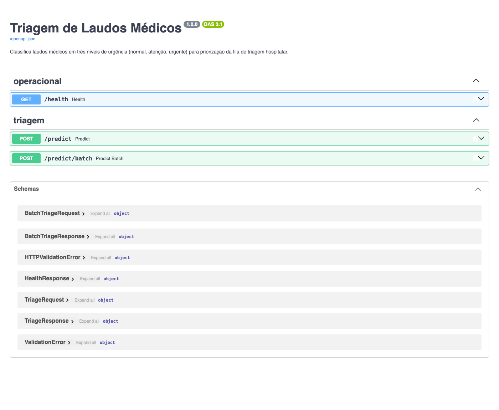
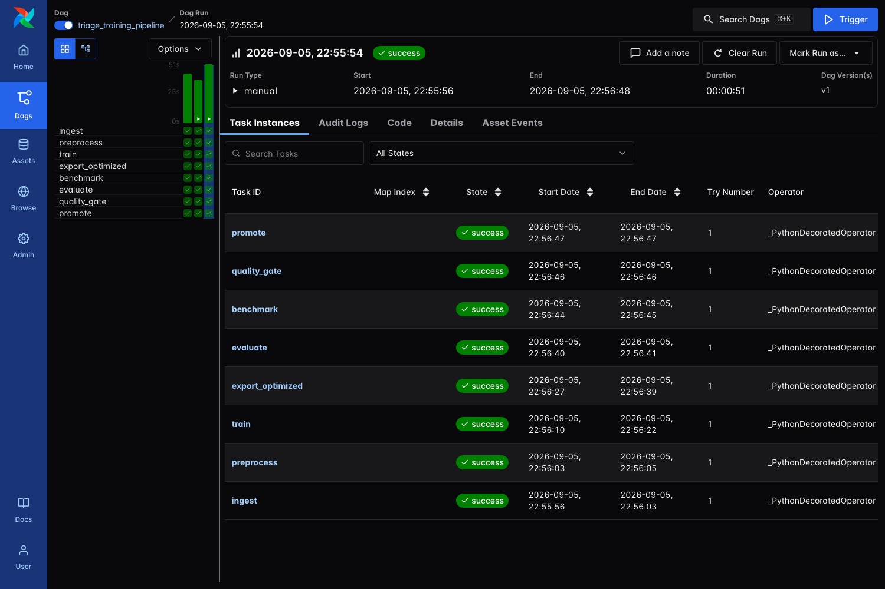
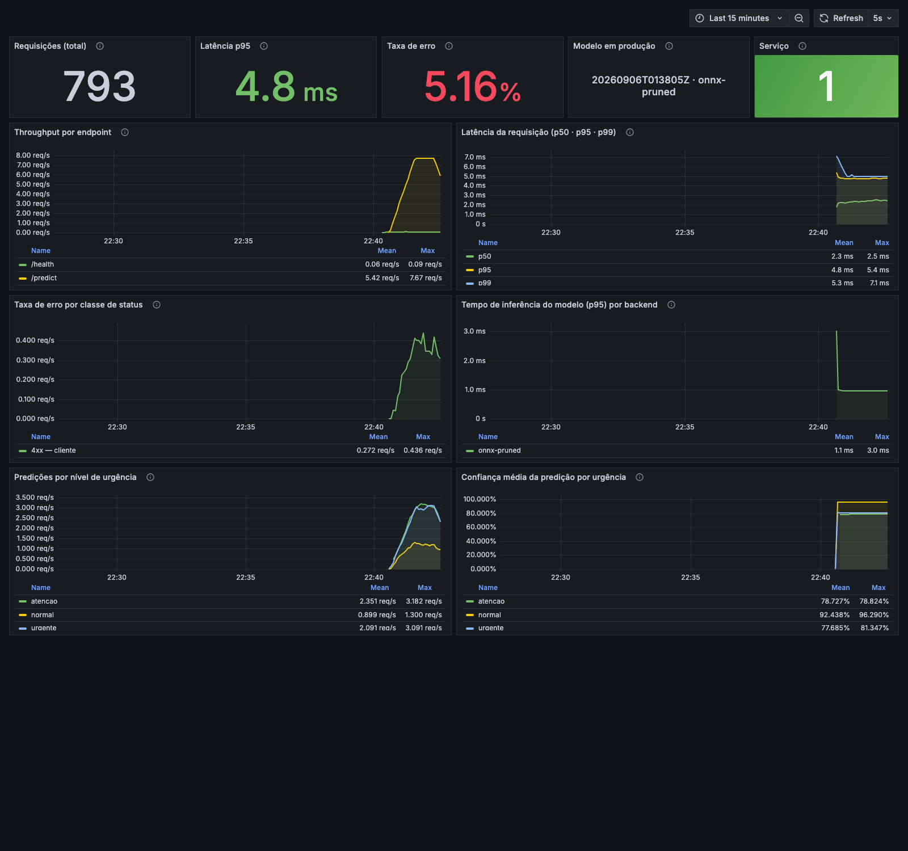

# Fase 3 — Triagem Automática de Laudos Médicos

> **Disciplinas:** Deploy em Nuvem · CI/CD e Pipeline de Treino · Monitoração de Performance e Serviços · Latência em Modelos Não Estruturados

Sistema de triagem que classifica laudos médicos em três níveis de urgência
— **normal**, **atenção** e **urgente** — para priorizar a fila de atendimento
hospitalar. O modelo é servido por uma API FastAPI em container, com inferência
otimizada em ONNX Runtime, retreino orquestrado por Airflow e observabilidade
em Prometheus + Grafana.

| | |
| --- | --- |
| **Modelo** | TF-IDF (uni + bigramas) + Regressão Logística multiclasse |
| **F1 macro (validação)** | 0,7267 · acurácia 0,7288 · 1.685 laudos |
| **Latência p95 (inferência)** | **0,10 ms** — 3,85× mais rápido que o baseline scikit-learn |
| **Artefato servido** | 0,42 MB (ONNX + pruning de vocabulário) |
| **Corpus** | [Medical Abstracts TC Corpus](https://github.com/sebischair/Medical-Abstracts-TC-Corpus) — 14.438 laudos |

---

## Índice

- [Como rodar](#como-rodar)
- [Decisão arquitetural de deploy em nuvem](#decisão-arquitetural-de-deploy-em-nuvem)
- [Infraestrutura como código](#infraestrutura-como-código)
- [Arquitetura da solução](#arquitetura-da-solução)
- [O modelo e os rótulos de urgência](#o-modelo-e-os-rótulos-de-urgência)
- [Otimização de latência](#otimização-de-latência)
- [API](#api)
- [Pipeline de treino e retreino](#pipeline-de-treino-e-retreino)
- [Observabilidade](#observabilidade)
- [CI/CD](#cicd)
- [Testes e qualidade de código](#testes-e-qualidade-de-código)
- [Variáveis de ambiente](#variáveis-de-ambiente)
- [Estrutura do projeto](#estrutura-do-projeto)
- [Limitações conhecidas](#limitações-conhecidas)

---

## Como rodar

Pré-requisitos: Docker e Docker Compose. Para rodar fora de container, Python
3.11 e [Poetry](https://python-poetry.org/).

```bash
cp .env.example .env
```

### 1. Treinar o modelo

O serving precisa de um modelo promovido no registry. O pipeline completo roda
em um comando e leva cerca de um minuto:

```bash
make install
make train
```

Isso baixa o corpus, prepara os dados, treina, exporta as variantes
otimizadas, avalia, mede latência, aplica o portão de qualidade e promove a
versão para serving.

### 2. Subir a stack de serving e monitoramento

```bash
make up
```

| Serviço | URL |
| --- | --- |
| API (Swagger) | http://localhost:8000/docs |
| Métricas Prometheus da API | http://localhost:8000/metrics |
| Prometheus | http://localhost:9090 |
| Grafana (dashboard já provisionado) | http://localhost:3000 |

### 3. Gerar tráfego para os painéis

```bash
make load
```

O gerador envia laudos reais do conjunto de validação a ~8 req/s e injeta 5%
de requisições inválidas, para que o painel de taxa de erro tenha o que
mostrar.

### 4. Subir o Airflow (opcional)

```bash
make airflow
```

A UI fica em http://localhost:8080 (sem login nesta stack local). A DAG
`triage_training_pipeline` já aparece registrada; basta despausar e disparar.

Para derrubar tudo:

```bash
make down
```

---

## Decisão arquitetural de deploy em nuvem

### O requisito manda no formato de deploy

A pergunta batch versus tempo real não se decide por preferência técnica, e sim
pelo que o caso de uso exige. Aqui o laudo é liberado e precisa ser
classificado **antes** de entrar na fila de triagem: um laudo que só recebe
prioridade na varredura noturna chega tarde para o paciente com suspeita de
infarto. O consumo é event-driven e sincronizado com o fluxo assistencial —
portanto, **inferência em tempo real, via API REST**.

Isso não exclui o processamento em lote; ele apenas resolve outro problema.
Adotamos um **desenho híbrido**:

| Caminho | Quando | Como |
| --- | --- | --- |
| **Tempo real** | Laudo liberado, triagem em curso | API REST síncrona, orçamento de p95 na casa das dezenas de milissegundos |
| **Batch** | Retreino semanal e reclassificação retroativa do acervo | DAG do Airflow, sem restrição de latência |

O batch tem papel definido: retreinar o modelo e, quando uma versão nova é
promovida, reprocessar o histórico para manter as filas coerentes. Rodar isso
online seria desperdício — não há usuário esperando a resposta.

### Alvo de deploy: AWS ECS Fargate

Para o caminho síncrono, a escolha é **ECS Fargate atrás de um Application
Load Balancer**, com a imagem versionada no ECR.

O que sustenta a escolha:

- **O container já é o artefato.** O mesmo `Dockerfile.api` que roda no
  compose local roda no Fargate sem alteração. Não há reempacotamento entre
  desenvolvimento e produção — e, portanto, nenhuma classe de bug que só
  aparece em um dos dois.
- **Sem gestão de instâncias.** O serviço tem tráfego previsível durante o
  horário de funcionamento e cai à noite. Fargate cobra por tarefa em
  execução, e o autoscaling por métrica de requisições acompanha essa curva
  sem que ninguém administre um cluster EC2.
- **O modelo é pequeno e roda em CPU.** O artefato servido tem 0,42 MB e a
  inferência leva 0,10 ms. Não há justificativa para GPU, e uma tarefa Fargate
  de 0,5 vCPU já sustenta com folga a carga de um hospital de referência.
- **Escala horizontal trivial.** A sessão do ONNX Runtime é configurada com
  uma única thread; a capacidade cresce adicionando réplicas, que é o eixo em
  que o Fargate é bom.

### Alternativas consideradas e por que foram descartadas

**AWS Lambda.** Seria mais barato no ocioso e o modelo cabe folgadamente no
limite de tamanho. O problema é o cold start: inicializar o runtime Python,
carregar o ONNX Runtime e abrir a sessão de inferência custa centenas de
milissegundos a alguns segundos — ordens de grandeza acima da inferência em si.
Em uma triagem clínica, uma cauda imprevisível é justamente o que não se pode
ter. *Provisioned concurrency* resolveria, mas ao eliminar a economia que era o
argumento a favor.

**SageMaker Endpoints.** Traz muito do que já temos por outro caminho
(versionamento de modelo, autoscaling, captura de dados) e é a escolha natural
quando o time todo já vive no ecossistema SageMaker. Aqui ele adicionaria
acoplamento a um serviço gerenciado e custo de endpoint sempre ligado, em troca
de recursos que o registry em disco e o Prometheus já cobrem para esta escala.

**Kubernetes (EKS).** Entrega tudo que o Fargate entrega e mais controle, ao
custo de um cluster para manter. Faz sentido quando já existe uma plataforma
Kubernetes na casa e outros serviços para amortizar esse custo — não para um
único serviço de inferência.

### Como as peças ficariam na AWS

| Componente local | Equivalente gerenciado |
| --- | --- |
| Container da API | ECS Fargate + ALB, imagem no ECR |
| Registry de modelos em disco | Artefatos no S3, versionados; a task lê na subida |
| Airflow em container | Amazon MWAA, ou ECS agendado por EventBridge |
| Prometheus + Grafana | Amazon Managed Prometheus + Managed Grafana |
| Logs da aplicação | CloudWatch Logs |

A troca é de substrato, não de arquitetura: os mesmos limites de latência, o
mesmo portão de qualidade e as mesmas métricas continuam valendo.

---

## Infraestrutura como código

A decisão acima está escrita em Terraform, em [`src/infra/`](src/infra) —
58 recursos cobrindo rede, serving, retreino agendado e observabilidade
gerenciada. O passo a passo, o desenho das tasks e a estimativa de custo estão
em [`docs/deploy_aws.md`](docs/deploy_aws.md).

**Nada foi aplicado.** A configuração está formatada, validada e com plano
gerado; quem quiser conferir provisiona na própria conta:

```bash
make validate-aws   # não precisa de credencial AWS
make plan-aws       # somente leitura
make build-aws      # provisiona (cobra)
make destroy-aws
```

A stack é a **versão enxuta** de propósito — NAT único, HTTP sem TLS, estado
local. São cortes de custo adequados a um projeto acadêmico, e cada um está
mapeado contra o equivalente de produção em
[`docs/deploy_aws.md`](docs/deploy_aws.md). O desenho não muda: tasks em subnet
privada, serving por registry somente-leitura, portão de qualidade e OIDC no
lugar de chave de acesso continuam valendo nos dois casos.

Dois pontos que valem destaque:

- **O código da aplicação não muda entre local e nuvem.** Localmente a API lê
  `models/` por um bind mount somente-leitura; na AWS, um container de
  inicialização sincroniza o mesmo diretório a partir do S3 e só então a API
  sobe. O contrato de serving é idêntico nos dois lados.
- **O retreino não usa MWAA.** Uma task Fargate agendada pelo EventBridge roda
  exatamente o mesmo `python -m src.pipeline`, com o mesmo portão de qualidade,
  por uma fração do custo de um ambiente Airflow gerenciado ligado o tempo
  todo. O raciocínio e o que se perde nessa troca estão documentados.

---

## Arquitetura da solução

```
                        ┌──────────────────────────────────┐
   laudo (JSON) ──────► │  FastAPI  /predict  /predict/batch│
                        │           /health   /metrics      │
                        └────────────┬─────────────────────┘
                                     │ carrega na subida
                                     ▼
                        ┌──────────────────────────────────┐
                        │  ONNX Runtime · sessão 1 thread  │
                        │  models/<versão>/model.pruned.onnx│
                        └────────────▲─────────────────────┘
                                     │ promove
   ┌─────────────────────────────────┴────────────────────────────────┐
   │  Airflow · triage_training_pipeline                              │
   │                                                                  │
   │  ingest → preprocess → train → export_optimized → evaluate       │
   │                                     └→ benchmark → quality_gate  │
   │                                                    └→ promote    │
   └──────────────────────────────────────────────────────────────────┘

   /metrics ──► Prometheus (scrape 5s) ──► Grafana (dashboard provisionado)
```

O ponto que amarra o desenho é o **registry em disco**: o pipeline de treino
escreve versões em `models/<timestamp>/` e só reescreve o ponteiro
`models/current.json` depois que a versão passa no portão de qualidade. A API
monta esse diretório somente-leitura e resolve o ponteiro na subida. Treino e
serving não compartilham nada além desse contrato, o que torna o rollback uma
operação de um arquivo.

---

## O modelo e os rótulos de urgência

O corpus escolhido é o **Medical Abstracts TC Corpus** (14.438 abstracts
médicos, licença CC-BY-4.0), sugerido no enunciado. Ele classifica cada texto
pelo **sistema do corpo acometido**, não por urgência — não existe corpus
público de triagem, com rótulo de prioridade e volume adequado, disponível
livremente.

A prioridade é então **derivada** por um mapeamento determinístico, declarado
em `src/configs/settings.py` e justificado clinicamente:

| Classe original | Urgência | Justificativa |
| --- | --- | --- |
| Cardiovascular · Sistema nervoso | `urgente` | Condições com protocolo tempo-dependente — infarto e AVC têm janela terapêutica medida em minutos |
| Neoplasias · Sistema digestivo | `atencao` | Investigação prioritária: fast-track oncológico, abdome agudo, hemorragia digestiva |
| Condições patológicas gerais | `normal` | Achados inespecíficos, compatíveis com fluxo eletivo |

O mapeamento produz uma distribuição naturalmente equilibrada — 35% urgente,
33% atenção, 32% normal — o que dispensa reamostragem e torna o F1 macro uma
métrica honesta.

**Isto é um rótulo proxy, e o projeto o trata como tal.** Um sistema em uso
real precisaria de rótulos de urgência atribuídos por triagem clínica, não
derivados de taxonomia anatômica. O detalhamento está em
[`docs/model_card.md`](docs/model_card.md).

### Por que um modelo linear

O orçamento de latência é o requisito dominante. Um transformer clínico daria
alguns pontos de F1 a mais e custaria duas ordens de grandeza em tempo de
resposta na CPU, exigindo GPU para voltar ao mesmo p95. TF-IDF com regressão
logística entrega probabilidades utilizáveis, converte limpo para ONNX e cabe
em menos de meio megabyte. Para triagem — onde o resultado é uma ordenação de
fila revisada por humanos, não um diagnóstico — é a troca certa.

---

## Otimização de latência

Três técnicas foram aplicadas e medidas. A análise completa, incluindo a
inspeção do grafo ONNX e a curva que fundamenta o ponto de corte do pruning,
está em [`docs/optimization.md`](docs/optimization.md).

| Backend | p50 | p95 | p99 | Throughput | Artefato | Ganho no p95 |
| --- | ---: | ---: | ---: | ---: | ---: | ---: |
| scikit-learn (baseline) | 0,34 ms | 0,39 ms | 0,42 ms | 2.902 req/s | 1,02 MB | 1,00× |
| ONNX Runtime | 0,17 ms | 0,20 ms | 0,23 ms | 5.730 req/s | 1,32 MB | 1,95× |
| ONNX Runtime INT8 | 0,17 ms | 0,19 ms | 0,20 ms | 5.828 req/s | 1,32 MB | 2,04× |
| **ONNX Runtime + pruning** | **0,09 ms** | **0,10 ms** | **0,11 ms** | **11.650 req/s** | **0,42 MB** | **3,85×** |

*500 inferências unitárias por backend, após 50 de aquecimento, uma thread por sessão.*

1. **ONNX Runtime** troca o caminho de inferência em Python por um grafo
   compilado em C++ — 1,95× no p95.
2. **Pruning do vocabulário** mantém os 10 mil termos de maior peso absoluto
   no classificador e reajusta o modelo sobre esse espaço. Ataca o
   `TfIdfVectorizer`, que a inspeção do grafo mostrou ser o nó dominante —
   mais 1,95×, artefato 3,1× menor, ao custo de 0,9 ponto percentual de F1
   macro.
3. **Quantização dinâmica INT8** foi aplicada e **não produziu efeito algum**.
   O grafo não contém nenhum `MatMul` ou `Gemm`: o classificador é um
   `LinearClassifier` do domínio `ai.onnx.ml`, cujos coeficientes ficam em
   atributos do nó em vez de initializers, e o quantizador devolve o modelo
   intacto. O resultado foi mantido na tabela em vez de omitido.

Reproduzir a medição:

```bash
make bench && make report
```

---

## API

### `POST /predict`

```bash
curl -X POST localhost:8000/predict \
  -H 'content-type: application/json' \
  -d '{"text":"acute myocardial infarction with st segment elevation, persistent chest pain radiating to the left arm, troponin markedly elevated"}'
```

```json
{
  "urgency": "urgente",
  "confidence": 0.8773,
  "probabilities": { "atencao": 0.0042, "normal": 0.1185, "urgente": 0.8773 },
  "model_version": "20260906T015610Z",
  "backend": "onnx-pruned",
  "inference_ms": 0.375
}
```

A resposta carrega a versão do modelo e o backend que a atendeu. Isso não é
enfeite: quando um resultado é contestado, é o que permite reconstruir qual
artefato produziu aquela classificação.

### Demais endpoints

| Endpoint | Descrição |
| --- | --- |
| `POST /predict/batch` | Até 100 laudos por chamada; o tempo é rateado entre os itens para manter a métrica por laudo comparável |
| `GET /health` | Estado do serviço, versão do modelo, backend e classes conhecidas |
| `GET /metrics` | Exposição Prometheus |
| `GET /docs` | Swagger UI |

### Modo degradado

Se nenhum modelo puder ser carregado, a API **sobe mesmo assim**: `/health`
responde `degraded`, `/metrics` marca `triage_model_loaded 0` e `/predict`
devolve 503. Morrer no boot deixaria o operador sem sinal nenhum e o container
em laço de restart — o oposto do que se quer de um serviço observável.



---

## Pipeline de treino e retreino

A DAG `triage_training_pipeline` roda semanalmente e encadeia oito tasks:

```
ingest → preprocess → train → export_optimized → evaluate ─┐
                                                            ├→ quality_gate → promote
                                                 benchmark ─┘
```



A DAG é uma casca fina: toda a lógica vive em `src/pipeline.py` e é coberta por
testes que rodam **sem o Airflow instalado**. O mesmo código é executado por
`make train` localmente e pelo scheduler em produção, o que elimina a classe de
bug em que o pipeline funciona no notebook e falha na orquestração.

### Portão de qualidade

Nenhuma versão vai a serving sem passar em dois critérios independentes:

| Critério | Limite | Protege |
| --- | ---: | --- |
| F1 macro | ≥ 0,60 | Qualidade da triagem, com as três urgências pesando igual |
| p95 de inferência | ≤ 25 ms | O orçamento de latência do serviço |

Reprovar em um deles já impede a promoção: o `metadata.json` da versão registra
a falha e o ponteiro `current.json` permanece na versão anterior. O serviço
continua servindo o modelo bom.

### Registry de modelos

```
models/
├── 20260906T015610Z/
│   ├── pipeline.joblib          # baseline scikit-learn
│   ├── pipeline.pruned.joblib   # após o pruning de vocabulário
│   ├── model.onnx               # ONNX float32
│   ├── model.int8.onnx          # ONNX quantizado
│   ├── model.pruned.onnx        # ← servido em produção
│   ├── metadata.json            # métricas, latência, portão, hiperparâmetros
│   ├── evaluation.json
│   └── latency_benchmark.json
└── current.json                 # ponteiro para a versão promovida
```

Um arquivo ponteiro em vez de symlink porque o repositório é compartilhado
entre macOS, Linux e Windows. Rollback é reescrever esse arquivo com a versão
anterior e reiniciar a API.

---

## Observabilidade

`make up` sobe API, Prometheus e Grafana. O datasource e o dashboard entram por
**provisionamento** — subir a stack em outra máquina reproduz os painéis sem
nenhum clique na interface.



### Métricas expostas

| Métrica | Tipo | Rótulos |
| --- | --- | --- |
| `triage_requests_total` | Counter | `method`, `endpoint`, `status_code` |
| `triage_request_duration_seconds` | Histogram | `method`, `endpoint` |
| `triage_inference_duration_seconds` | Histogram | `backend` |
| `triage_predictions_total` | Counter | `urgency` |
| `triage_prediction_confidence` | Histogram | `urgency` |
| `triage_errors_total` | Counter | `type` |
| `triage_model_info` | Gauge | `version`, `backend` |
| `triage_model_loaded` | Gauge | — |

Duas decisões de instrumentação que valem registro:

- **Os buckets de latência foram redefinidos.** Os defaults do
  `prometheus_client` começam em 5 ms — acima do tempo total de resposta deste
  serviço. Todas as observações cairiam no primeiro bucket e o p95 seria
  inútil. Os buckets vão de 1 ms a 1 s, concentrados abaixo de 100 ms.
- **O rótulo `endpoint` usa o template da rota**, não a URL, para não explodir
  a cardinalidade das séries.

### Os 11 painéis

Indicadores de topo: requisições acumuladas, p95 atual, taxa de erro, versão e
backend do modelo em produção, e disponibilidade do modelo.

Séries temporais: throughput por endpoint · latência p50/p95/p99 · taxa de erro
separada em 4xx e 5xx · tempo de inferência p95 por backend · predições por
nível de urgência · confiança média por urgência.

Os dois últimos são de detecção de desvio, não de infraestrutura: uma mudança
brusca na distribuição das classes previstas, ou uma queda sustentada na
confiança, indica que a população de laudos mudou — em geral **antes** de a
qualidade cair de forma mensurável.

---

## CI/CD

O workflow [`phase-3-ci.yml`](../../.github/workflows/phase-3-ci.yml) dispara em
push na `main` e em qualquer pull request que toque `phases/phase-3/**`:

| Job | O que faz |
| --- | --- |
| `lint` | `ruff check` e `ruff format --check` em `src/`, `tests/`, `scripts/` e `airflow/` |
| `unit-test` | `pytest tests/unit` com cobertura mínima de 70% |
| `e2e-test` | `pytest tests/e2e` — treina um modelo de verdade e exercita a API nos quatro backends |
| `dag-validate` | Instala o Airflow, serializa a DAG e falha se houver erro de importação |
| `terraform-validate` | `fmt -check`, `init` e `validate` da infraestrutura, sem credencial e sem tocar em conta alguma |
| `docker-build` | Builda a imagem da API, sobe o container **sem modelo montado** e verifica que ele entra em modo degradado em vez de morrer |
| `deploy` | Publica no ECR e atualiza o serviço ECS via OIDC. **Desligado por padrão** — só roda com `AWS_DEPLOY_ENABLED=true` |

Os dois últimos existem por motivos específicos. Erro de importação em DAG não
quebra o CI da aplicação — só aparece quando o scheduler já está em produção.
E o smoke test do container é o que teria pego, antes do deploy, a falha de
locale que derrubava a API no boot (documentada em `docs/optimization.md`).

---

## Testes e qualidade de código

```bash
make test    # 100 testes, cobertura de 84% em src/
make lint    # ruff check + format --check
```

| Suíte | Cobre |
| --- | --- |
| `tests/unit` | Mapeamento de urgência, limpeza e split, registry, pruning, exportação ONNX, percentis do benchmark, portão de qualidade, validação dos schemas, resolução de caminhos, e o pipeline completo sobre um corpus mínimo |
| `tests/e2e` | A API nos quatro backends, o modo degradado, e a equivalência entre o grafo exportado e o pipeline de origem |

Vale destacar um teste: `test_exported_graphs_match_the_source_pipeline`
verifica que ONNX e INT8 classificam igual ao scikit-learn. Otimizar é uma
transformação que precisa preservar o comportamento — uma divergência aqui é
bug de exportação, não variação aceitável.

---

## Variáveis de ambiente

Configuradas via `.env` (ver `.env.example`), lidas por `src/configs/settings.py`.

| Variável | Default | Descrição |
| --- | --- | --- |
| `INFERENCE_BACKEND` | `onnx-pruned` | Backend servido: `sklearn`, `onnx`, `onnx-int8` ou `onnx-pruned` |
| `RANDOM_SEED` | `42` | Seed de reprodutibilidade |
| `PROJECT_ROOT` | deduzido | Raiz contra a qual caminhos relativos são resolvidos |
| `DATA_RAW_DIR` | `data/raw` | Corpus bruto |
| `DATA_PROCESSED_DIR` | `data/processed` | Splits de treino e validação |
| `MODELS_DIR` | `models` | Registry de modelos |
| `METRICS_DIR` / `REPORTS_DIR` | `metrics` / `reports` | Saídas de avaliação e benchmark |
| `VALIDATION_SIZE` | `0.15` | Fração reservada para validação |
| `TFIDF_MAX_FEATURES` | `30000` | Vocabulário antes do pruning |
| `TFIDF_MIN_DF` / `TFIDF_NGRAM_MAX` | `3` / `2` | Frequência mínima e ordem máxima dos n-gramas |
| `LOGREG_C` | `4.0` | Regularização inversa |
| `PRUNE_KEEP_FEATURES` | `10000` | Termos mantidos após o pruning |
| `MIN_MACRO_F1` | `0.60` | Piso de qualidade do portão |
| `MAX_P95_LATENCY_MS` | `25.0` | Teto de latência do portão |
| `BENCHMARK_RUNS` / `BENCHMARK_WARMUP` | `500` / `50` | Iterações do benchmark |

> Use sempre `/` como separador, mesmo no Windows — os valores são usados
> dentro de containers Linux.

---

## Estrutura do projeto

```
phases/phase-3/
├── README.md
├── Makefile                     # atalhos: install, train, up, load, bench, test, lint
├── docker-compose.yml           # api + prometheus + grafana; profiles: orchestration, load
├── pyproject.toml / poetry.lock
├── airflow/dags/
│   └── triage_training_pipeline.py
├── docker/
│   ├── Dockerfile.api           # multi-stage, usuário sem privilégios, healthcheck
│   ├── Dockerfile.airflow
│   └── requirements-airflow.txt
├── monitoring/
│   ├── prometheus/prometheus.yml
│   └── grafana/provisioning/    # datasource + dashboard (11 painéis)
├── src/
│   ├── infra/                   # Terraform: VPC, ECS, ALB, S3, EventBridge, AMP/AMG
│   ├── configs/settings.py      # Pydantic Settings, mapeamento de urgência
│   ├── data/                    # ingest, preprocess
│   ├── models/                  # train, prune, export, registry
│   ├── evaluation/              # evaluate, benchmark
│   ├── inference/predictor.py   # backends intercambiáveis
│   ├── app/                     # api, schemas, metrics
│   └── pipeline.py              # etapas orquestráveis + portão de qualidade
├── scripts/
│   ├── loadgen.py               # gerador de tráfego para a demo
│   └── report_latency.py        # tabela de latência em Markdown
├── tests/{unit,e2e}/
└── docs/
    ├── model_card.md
    ├── optimization.md
    ├── deploy_aws.md
    └── images/
```

---

## Limitações conhecidas

- **O rótulo de urgência é derivado, não observado.** A prioridade vem de um
  mapeamento sobre a taxonomia anatômica do corpus, não de triagem clínica
  real. É a limitação mais séria do projeto e está detalhada no model card.
- **O corpus é de abstracts em inglês.** Laudos hospitalares brasileiros têm
  vocabulário, abreviações e estrutura diferentes; o modelo precisaria ser
  retreinado sobre dados em português antes de qualquer uso real.
- **A API carrega o modelo na subida.** Promover uma versão nova exige
  reiniciar o serviço. Para esta escala é aceitável — um deploy rolling no ECS
  resolve sem downtime —, mas um recarregamento a quente evitaria o passo.
- **Sem alertas configurados.** O Prometheus coleta e o Grafana exibe, mas não
  há regras de alerta. Os painéis de confiança e distribuição de classes são
  os candidatos naturais a virarem alertas de desvio.
- **Airflow com SQLite e executor local.** Adequado para demonstrar a
  orquestração; produção exigiria backend Postgres e executor distribuído.
- **A infraestrutura AWS não foi aplicada.** O Terraform está validado e com
  plano gerado, mas nenhum recurso existe.
- **A stack provisionada é a versão enxuta, de propósito.** NAT único, listener
  em HTTP, estado do Terraform local e sem WAF — cortes de custo e escopo
  adequados a um trabalho que precisa ser provisionado e destruído por quem
  avalia. O que mudaria em produção está mapeado item a item em
  [`docs/deploy_aws.md`](docs/deploy_aws.md#este-projeto-não-é-uma-stack-de-produção--e-isso-é-deliberado).
